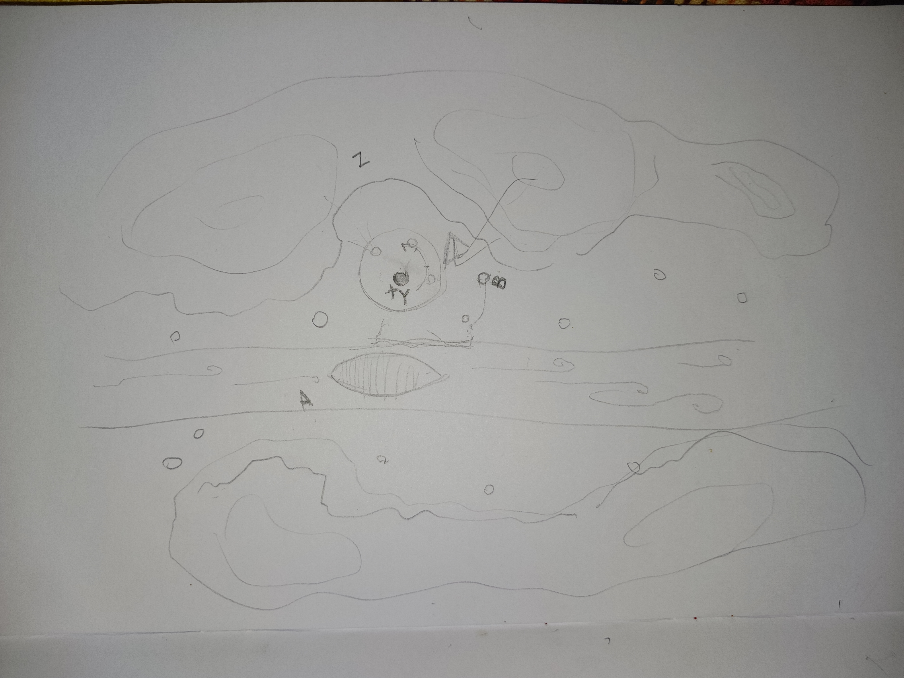

# Session 2

- party had left from town right after reading the scroll, so they had plenty of time. spent time paddling up the river, talking with each other.
- Atka was hanging off the back, kicking his legs to power the boat. he has never directly interacted with a spirit for, so is feeling excited and nervous about this possibility.
    - also, this was his first time really seeing the effects of the war, previously Ukyuk had always told him that both sides were at fault, and that the Northern Water Tribe had to stay out, as they were bringing imbalance. Atka had always accepted that, but is now questioning it. had a memory of Ukyuk and Sister Waaseyaa fighting about this, as she tries to convince him to get involved
- make camp for first night, try to decide what to do. want to try and make contact with spirit before the day when Weishan materializes, unsure how. 
- flashback to Atka raiding his lineage's resources to get a book, Siqniq's Fables, before he left, which contains educational fables about the Spirit World (no consequences from this)
- Atka and Zo have several fights about how to handle things, with Zo thinking that Atka is naive: there are people who will try to take power and they need to be fought, they cannot just be asked nicely.
- Bao is used to tension in her group, isn't too worried about ability to pull them together
- next day, make it the rest of the way to the spring, arrive as sun is going down. the river comes up and ends in a small mountain lake, with a large plum tree on the shores, shading it, with a small cairn at its roots. path leading to peak (so higher ground, with rocks), but this is clearly the most spiritual location and the one shown in the scroll
    - they could tell it's spiritually important because: color saturated, sounds clear and crisp (Atka), too quiet, no sounds of human activity (Zo), got chills, feel connected to nature, like shrine (Bao)
- Atka recalls the most relevant story in Siqniq's Fables: a waterbender named "Ass-op" wanted to learn how to dance with the moon, but was too shy to ask it directly, so on the night before the full moon, went to the river and asked it how to dance. the river guided it through the movements so the waterbender was ready when the moon came the next night. 
- Zo and Bao get in fight trying to decide what to do next: Zo wants to go investigate the cairn directly, whereas Bao wants to map out the area, make sure they're the only ones there, and that they're safe. Bao ends up pushing Zo towards Restraint principle and Zo stalks off
    - Zo looks around and sees the area is clear, but that there's an obvious camp about back where they were last night, with four campfires, and the gleam of a boat in the river
    - Bao investigates area for defensability and whether they can use the landscape, considers possible plans
    - Atka investigates the cairn, a collection of rocks small enough to be carried in hand, some recent, most old, worn smooth, all local.

{ .center width=50% }

- they reconvene, Zo tries to make it up to them by offering plums from the tree, but Bao is uninterested.
- Atka takes one and goes to meditate. he's very nervous, unsure what to do, but he takes a bite of the plum (camera zooms in, we hear the crunch of that first bite, and all the distractions fall away), and sits down between the cairn and the lakeshore to meditate.
    - he hears the lapping of the waves upon the beach, the rustling of the leaves in the wind, and those transform to wingbeats, as he suddenly feels the (large) presence of Weishan, just curious as to who this person is
    - no ability to communicate in words, but they're aware of each other. Atka tries to communicate welcome and then that tomorrow there will be a danger. feels an acknowledgment and then withdrawal from the spirit
- during this time, Zo had been patrolling (unnecessarily) around the perimeter, periodically stopping by Bao and saying "all's clear", as Bao sits down and sketches out various plans
- Atka comes out of his meditation (for him, felt like 5 minutes, was 1.5 hours), stands up and does an arm-pump and "yes", before trying to explain to the others what happened. he doesn't do a good job of this
- they then discuss next plans, and end up deciding to try and sneak to the Fire Nation camp, free Yating, and sabotage the ship. main goals are to get Yating and prevent the Fire Nation soldiers from reaching the spring, and they don't want to fight in the sacred space of the grove
- on the way, Bao and Atka practice their technique for sabotaging the boat: Bao will raise the boat up on rock pillars, and then Atka will freeze the boat in place (don't think ice would be strong enough by itself)

- when they get close, Atka waits in the water near the boat, while Zo waits on the cliffs above the camp and Bao waits in the tree nearby
- Bao will signal them with the signal she used with her old team: a slight rumble underneath their feet (like a cell phone buzzing)
- only one campfire is still lit, with one guard standing nearby and a second patrolling around the area
- Bao sees Yating near the standing guard near the campfire, signals her by rumbling the ground beneath her, then quickly peering out and making eye contact
- Bao and Zo decide to simultaneously take them out: Zo sneaks up on the patrolling guard and knocks him out efficiently, while Bao sneaks through the river and up to get to the standing guard and knocks him out with a rock fist. This is the first time Bao has ever really done violence, and is shocked by it (the guard was an earthbender), becomes **Guilty**
- they quickly take Yating back to the boat by the river, then Zo escorts Yating up to their hidden canoe upriver while Bao and Atka try to take out the boat
- Bao successfully raises the boat out of the river, but Atka had been bored while waiting and floated slightly downstream: his ice doesn't cover the whole boat. for a while, it looks fine, but then the fact that the ice is only on one side causes it to tip over and crash off the pillars onto the ground
- the boat is damaged, alright, but the sound woke up the entire camp.
- Zo runs back from Yating to meet up with them
- Bao gets ready to cause an avalanche onto the camp, to take out the soldiers, but at the last moment locks eyes with one of the guards, another earthbender, waking up and has a moment of shared humanity (I too have been tired just waking up from a nap, sees the terror in his eyes as he realizes Bao is triggering an earthquak) and catches herself, so that the avalanche barely starts: rocks are bouncing around, going into the river, causing chaos, but no real damage to camp
- we end session as combat is getting ready to start: Zo makes it back just as the guards are assembling themselves and standing up
