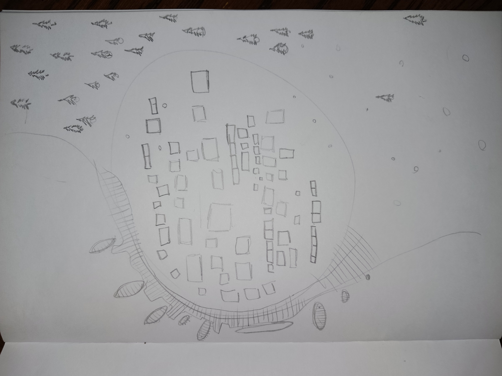

# Session 4

- party started by hiding Atka's canoe (which he was medium-attached to) underground among the trees behind the little mountain where they fought Hanako and co, marking a tree nearby with a roughly-carved X (Zo did so while annoyed at how long Bao and Atka seemed to be taking)
- then set off, trying to track Yating and find where she went. followed tracks up river a ways, then veered off through the woods before reaching Weishan's grove at the top
- Zo led the tracking expedition, following the signs through the woods. while she had handled tracking during training, this was her first time doing actual tracking, and she was surprised at how much harder it was, how long she would go between seeing signs of Yating that made her believe they were still on the right track. was constantly reaching out to Bao for reassurance that she was doing alright
    - Atka just following along behind, kind of copying how Bao acts, since he thinks that she knows best. this is his first time being so far from bodies of water, and is entranced by the sheer amount of life in the forest, stopping to look at every bug and constantly wondering whether this was a spirit or that was a spirit
    - "is that a bug spirit?" "No, Atka, it's just a bug". "Is that a deer spirit", "no Atka, it's just a deer"... but then the deer's face shifts before the camera pans away, and only Atka can see it
- rest for the night and recuperate while still on Yating's trail (clearing all fatigue and conditions)
- they then continued on their path, coming up a hill where Zo clearly smelled smoke, they found the following scene:

- the forest they were trekking through ends in a sudden clear-cutting, surrounding a village down along the coast, where smoke is pouring out of several buildings
- Zo realizes that this is a fire nation colony, which is converting the trees into charcoal and carting that away to use in the ships, in other war machines, and back on the home islands. and that the former inhabitants of this town are doing forced labor here to create the charcoal
    - Atka faints from the sudden feeling of emptiness, the shock of going from somewhere so full of life to so empty of it. and feels the wrongness of it
    - this is the first time Bao has really seen the effects of the war she left home to find, and she is troubled by it, and feeling a little bit vindicated -- she was right, there are terrible things happening out there
- they plan to sneak into town, look around and find some information. Zo will try to infiltrate the soldiers, hoping that she can pretend to be herself from several weeks ago, that news of her desertion and betrayal haven't spread far, but worried/upset about having to pretend that everything's cool. Atka and Bao will try to infiltrate
- they wait until dusk, then sneak down to town and steal some earthbending clothes for Atka. he sneaks up on someone bathing outdoors, grabs their clothes and replaces it with a fish as payment ("mom! this walking fish stole my clothes!")
    - the only powerful / impressive earthbender that Atka knows is Bao, so he steals clothes that look exactly like hers: a crop top ending in tassles and baggy [Turkish trousers (shalvar)](https://en.wikipedia.org/wiki/Turkish_salvar)
    - Zo thinks it's ridiculous that they're dressed alike and tells Atka that he would look better in a vest, so he takes off the tassles (attaching them to his gloves to play with) and cuts the crop top down the middle to turn it into a vest
- while he's doing this, Zo and Bao get into a fight about their plan: Zo thinks they should split up and search independently, meeting back up in 24 hours, while Bao wants Atka to stay behind so he can stay safe and run off for help, if needed
    - Bao tries to **guide** Zo on this and Zo shuts her down, making her insecure and stalking off into the woods to gather plants for medicine
    - Atka talks through what just happened with Bao, to make her see that she can't control everything perfectly and that sometimes she must go more with the flow, in the process learning that she's so worried because she thinks she got her friend killed (or something) because she wasn't able to plan effectively. Atka tries to convince her this wasn't her fault, **comforting** her and clearing her condition
- Zo comes back, Bao apologizes for losing her cool (Zo grunts in approval but doesn't apologize or anything), and the tension is somewhat disappated. the camera pans out on the party bickering about whether Atka can take his cool rock / bug / leaf collection with him ("they're my spirit friends!") or whether they can find a safe place to keep them while they go undercover to find information
